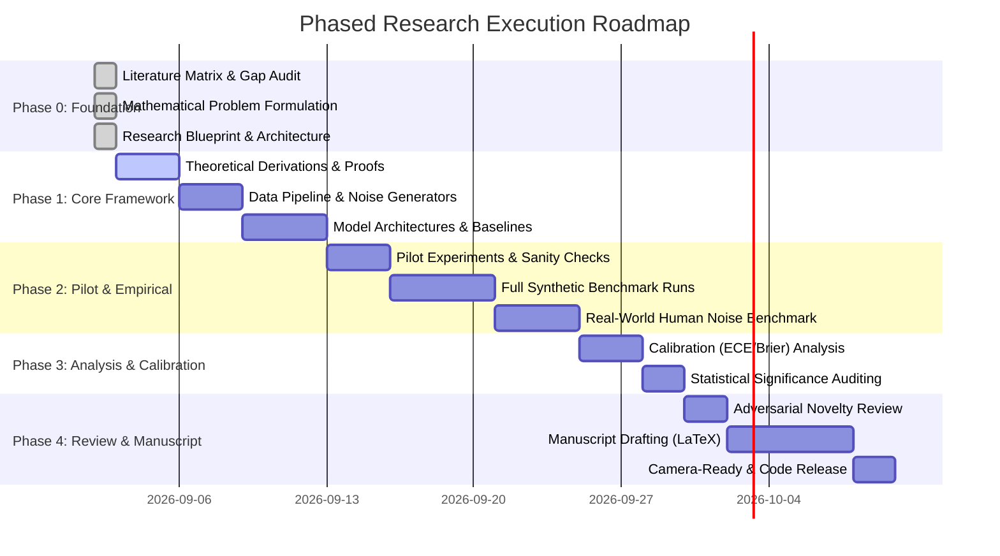

# Research Roadmap

---

## Phase Details

### Phase 0: Research Foundation & Repository Architecture (CURRENT)
- Exhaustive literature matrix & source notes.
- Theoretical formulation of clean vs noisy risk, transition matrix $T$, forward/backward correction.
- Adversarial novelty audit and risk analysis.
- Phase 0 Research Blueprint.

### Phase 1: Mathematical Foundations & Pipeline Implementation
- Formal verification of theoretical propositions.
- Modular Python source implementation:
  - Noise injection modules (Symmetric, Asymmetric, Pair-flip, Instance-dependent).
  - Transition matrix estimators (Anchor point, Dual-T, Confident Learning).
  - Robust loss function implementations (GCE, SCE, MAE, NCE+RCE).
  - Loss correction layers (Forward, Backward).
  - Sample-selection baselines (Co-teaching, DivideMix).

### Phase 2: Pilot Validation & Comprehensive Benchmarking
- Pilot sanity checks on toy synthetic 2D datasets and MNIST.
- Full experimental execution on CIFAR-10, CIFAR-100, CIFAR-10N, Animal-10N across 5 seeds.

### Phase 3: Calibration, Dynamics & Statistical Verification
- Deep analysis of memorisation curves, early learning inflection points, and transition matrix Frobenius error.
- Comprehensive reliability diagram plotting and ECE calculation.
- Wilcoxon signed-rank and paired t-tests.

### Phase 4: Peer-Review Simulation & Manuscript Preparation
- Simulated peer reviews (NeurIPS / ICML format).
- Complete LaTeX manuscript drafting with figures and tables.
- Reproducibility verification and open-source release.
