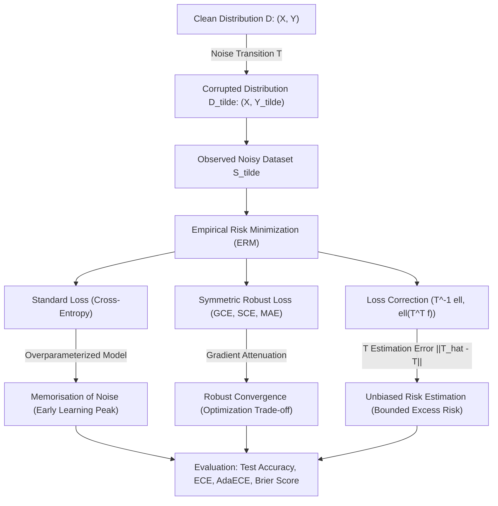

# Theory Summary & Mathematical Framework

## 1. Unified Theoretical Architecture

The theoretical foundation of this research establishes a complete closed-loop mapping from data generation under label noise to empirical risk minimizer excess risk and calibration degradation.

---

## 2. Core Takeaways from Theoretical Investigation

1. **Unbiasedness vs. Practical Convexity**:
   - Backward correction ($\vec{\tilde{\ell}} = T^{-1} \vec{\ell}$) is exact in expectation, but produces negative losses that destabilize SGD.
   - Forward correction ($\ell(T^\top f(x), \tilde{y})$) avoids negative values and preserves smooth SGD, but is an approximation when $f$ is non-linear.
2. **Transition Matrix Sensitivity**:
   - The excess risk inflation scales proportionally to $\|T^{-1}\|_2^2 \|\hat{T} - T\|_F$. Highly noisy or near-singular transition matrices (where $\kappa(T) \gg 1$) severely amplify estimation errors.
3. **Loss Function Symmetry vs. Multi-Class Convexity**:
   - No strictly convex surrogate loss can be symmetric across $K \ge 3$ classes. Thus, robust losses must deliberately balance robustness (e.g. MAE component) with gradient drivability (e.g. Cross-Entropy component).
4. **Calibration Degradation Mechanics**:
   - Label noise directly warps the observed posterior simplex $\vec{\tilde{\eta}}(x) = T^\top \vec{\eta}(x)$, driving systematic miscalibration (ECE > 0) that cannot be repaired by standard unregularized cross-entropy minimization.
